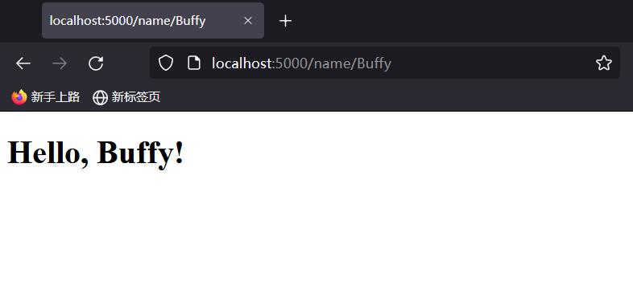
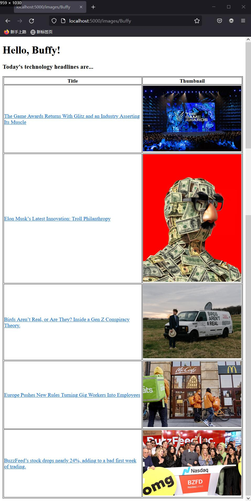

# SI507FA21 HW7: Flask
A Flask app that retrieves headlines from New York Times API
Instructor: Bobby Madamanchi

## API Used
[New York Times API](https://developer.nytimes.com/)

## Assignment Instructions
[HW_7_Flask.pdf](HW_7_Flask.pdf)

## Code Usage
To run the app locally, download this repo to your local environment. 
An API key is needed
(see "Query New York Times API" in [instructions](HW_7_Flask.pdf)).  
Store your API key in a new file called secrets.py:
```python
api_key = '<your api-key>'
```
In the terminal, run:
```commandline
python top_headlines.py
```
you should see something like:


## Demos
### Default Home Page
URL: http://localhost:5000/  

### Get User Names
URL: http://localhost:5000/name/Buffy *("Buffy" can be replaced by any other names)*  

### Headlines
URL: http://localhost:5000/headlines/Buffy *("Buffy" can be replaced by any other names)*  

### Headlines with Links (Extra Credit 1)
Links to the actual story on NYT.   
URL: http://localhost:5000/links/Buffy *("Buffy" can be replaced by any other names)*  

### Table with Headlines and Thumbnails (Extra Credit 2)
URL: http://localhost:5000/images/Buffy *("Buffy" can be replaced by any other names)*  

